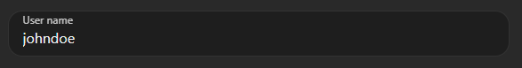

# Introduction

The `xo-form` component library generates web forms from a declarative schema.

`xo-form` schemas are [JavaScript Object Literals](https://developer.mozilla.org/en-US/docs/Web/JavaScript/Guide/Working_with_Objects#object_initializers) that are easily written, or generated from your code.

`xo-form` supports full two-way databinding to map a form to a data model and interface with APIs directly as the model changes.

The library is written as pure native [Web Components](https://developer.mozilla.org/en-US/docs/Web/Web_Components) in [ES6+](https://en.wikipedia.org/wiki/ECMAScript) Modules, and has just one dependency: [Lit](https://www.npmjs.com/package/lit).

## Features

- Reactive Rendering
- Direct Model Binding to Element Properties
- Full two-way Databinding
- Multi-page Forms/Wizards
- Powerful Rules engine for Conditional Logic
- Supports all HTML elements, including Custom Elements (Web Components)

# Setup

`npm i xo-form`

# How it works

```xo-form``` is a Web Component (```<xo-form></xo-form>```). You pass a form schema either by setting the ```schema``` property directly, or by setting ```src``` to a path to dynamically load a js module from.

In the case below, we're loading a js module:

```html
<xo-form theme="material" src="/forms/my-form.js"></xo-form>
```

... where my-form.js looks like this:

```js
export const form = {
  model: {
    instance: {
      state: {},
      data: {
        name: "",
        msg: "",
      },
    },
    rules: {
      "#/state/submit": [
        {
          value: (context) => {
            alert(
              JSON.stringify(
                context.model.instance.data, 
                null, 
                2));
          },
        },
      ],
    },
  },
  pages: [
    {
      label: "My Form",

      fields: [
        {
          type: "text",
          bind: "#/data/name",
          required: true,
          label: "Your name",
          placeholder: "Enter your name",
        },
        {
          type: "textarea",
          bind: "#/data/msg",
          label: "Your message",
          required: true,
          placeholder: "Enter a message",
          maxlength: 100,
          rows: 6,
        },
        {
          type: "button",
          bind: "#/state/submit",
          label: "Submit",
        },
      ],
    },
  ],
};
```

## Understanding ```xo-form``` schemas

### Main elements

#### ```pages```

The ```pages``` node is an array of ```page``` elements. Each page describes a set of controls that are grouped together, mostly in separately shown wizard steps, but pages could also be shown differently, in a tabstrip for instance.

#### ```model```

The ```model``` property contains all data model related elements, such as the ```instance``` node that contains one or multiple named instance nodes.

In the example below, the ```myData``` node defines data that a form can bind to:

```js
export const form = {
  model: {
    instance: {
      myData: {
        userName: "johndoe"
      }
    }
  },
  pages: [
    {
      fields: [
        {
          type: "text",
          label: "User name",
          bind: "#/myData/userName"
        }
      ]
    }
  ]
}
```
Result:


## Schema & Control Creation

### Explicit and implicit element types

The ```pages``` and ```controls``` nodes in an ```xo-form``` schema are interpreted at runtime and generate controls.

In the case of a page, an ```xo-page``` element is implicitly created. The ```xo-page``` element inherits from the ```xo-group``` element. Groups can be created explicitly as well, using the following syntax:

```js
{
  type: "group", // xo-group element
  fields: []
}
```

### Rules used to map schema types to elements 

The schema interpreter has some very simple rules to generate element from the schema nodes:

- If the ```type``` property starts with 'xo-', the corresponding XO element is instantiated.
- If ```document.createElement(type)``` is successful, the returned object is used.
- If type doesn't contain a dash (```-```), the interpreter tries to create an ```HtmlInputElement``` and set its ```type``` property to the given type.

